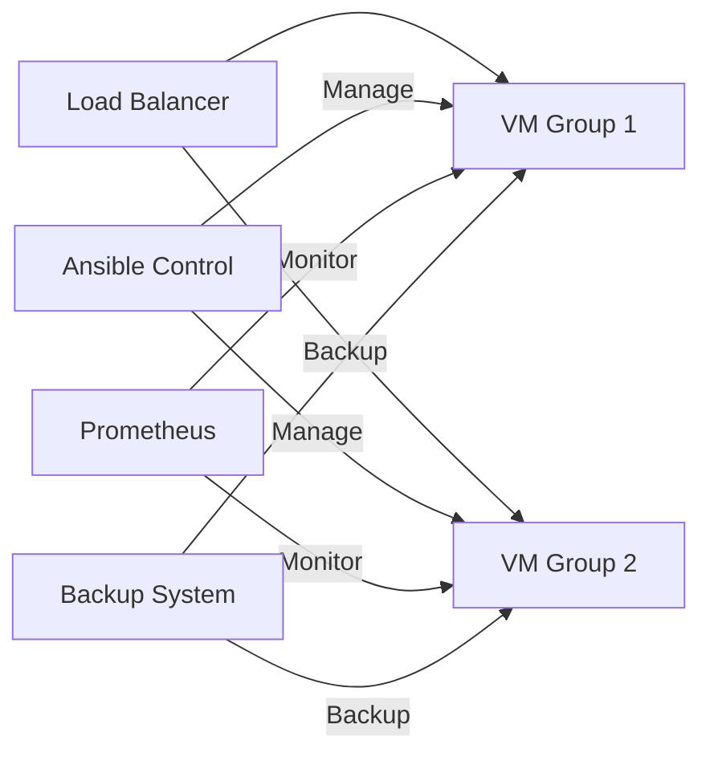

# 🚀 VMware Auto-Scaling Web Cluster with Smart Backup System

  
*A hybrid intelligent system for automated web cluster management and backup on VMware ESXi*

## 📌 Table of Contents
- [Project Overview](#-project-overview)
- [Key Features](#-key-features)
- [System Architecture](#-system-architecture)
- [Prerequisites](#-prerequisites)
- [Installation](#%EF%B8%8F-installation)
- [Usage](#-usage)
- [Technical Documentation](#-technical-documentation)
- [Contributing](#-contributing)
- [License](#-license)

---

## 🌟 Project Overview

This project provides a **fully automated solution** for managing web clusters on VMware ESXi with two core integrated capabilities:

1. **Intelligent Auto-Scaling** based on traffic and resource utilization
2. **Automated Backup System** with enterprise-grade encryption

> 💡 **Why This Project Stands Out**  
> The first open-source system that seamlessly combines cluster management and backup solutions for VMware using Ansible!

---

## ✨ Key Features

### 🌀 Auto-Scaling
- Real-time traffic analysis (Nginx Logs)
- Horizontal and vertical scaling
- Prometheus integration for monitoring

### 💾 Smart Backup
- AES-256 encrypted snapshots
- Multi-cloud backup (AWS S3/MinIO)
- Intelligent lifecycle management

### 🔔 Alert System
- Multi-channel notifications (Telegram/Email)
- Weekly performance reports

---

## 🏗 System Architecture

